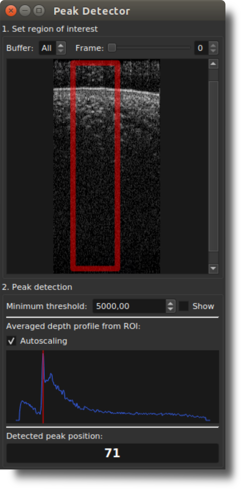

# Peak Detector extension for OCTproZ
Peak Detector is a plugin for [OCTproZ](https://github.com/spectralcode/OCTproZ).  

  

The Peak Detector extension displays the depth position of the highest value within an averaged A-scan. This averaged A-scan is generated by averaging the A-scans within the user-changeable Region of Interest (ROI) within the B-scan.

This extension can be used as a basis for implementing more advanced OCT peak detection techniques.

## License
Peak Detector is licensed licensed under GPLv3. See [LICENSE](LICENSE).
